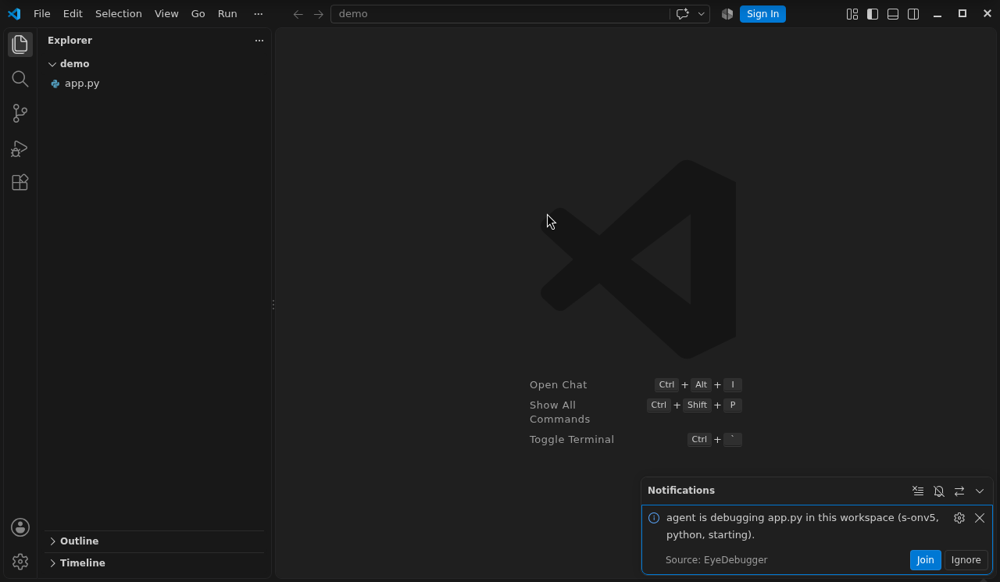
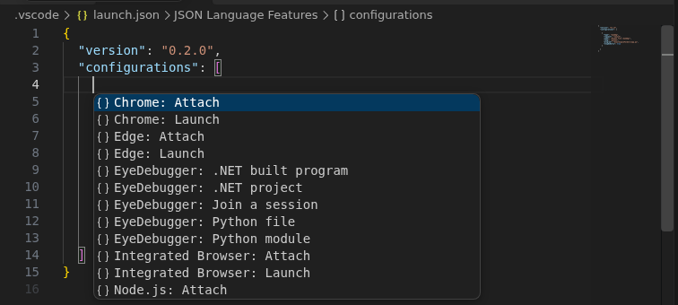
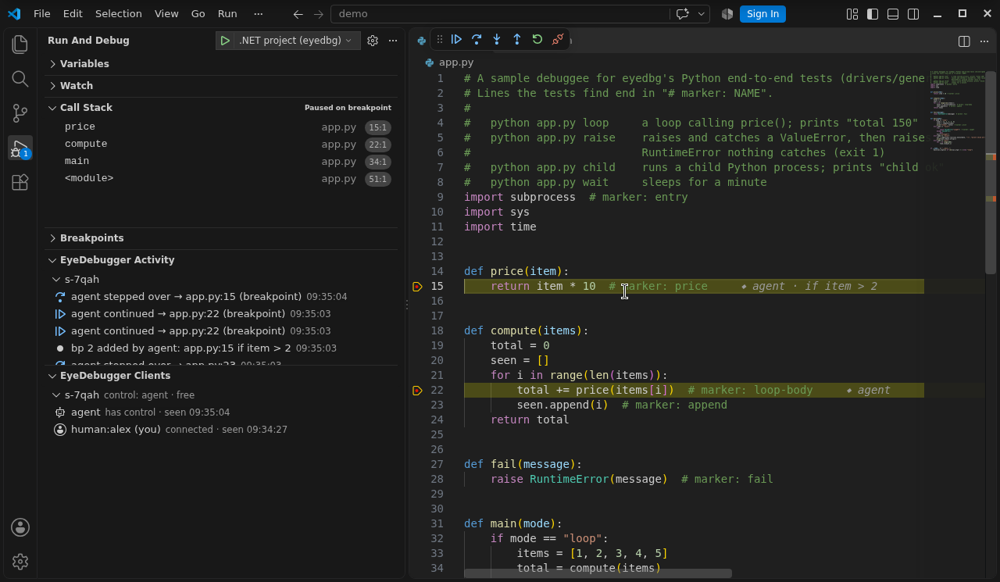
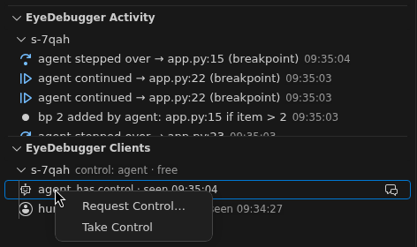

# EyeDebugger for VS Code

Debug alongside an AI agent. [eyedbg](https://github.com/EyeDebugger/eyedebugger) is a CLI-first
debugger that agents drive from the shell; this extension lets you join the agent's live debug
session in VS Code — see where it stopped, its breakpoints, what it does — and take or ask for
control. Or start a session yourself with F5 and let the agent join you.

## Install

Download `eyedebugger_X.Y.Z_vscode.vsix` from a [GitHub
release](https://github.com/EyeDebugger/eyedebugger/releases), then:

```sh
code --install-extension eyedebugger_X.Y.Z_vscode.vsix
```

Optionally check its provenance: `gh attestation verify eyedebugger_X.Y.Z_vscode.vsix -R
EyeDebugger/eyedebugger`.

## Requirements

- `eyedbg` with editor support (`eyedbg version --json` lists `dap.collab`), on your `PATH` or set
  in `eyedbg.path`.
- The debug adapter for your language, as eyedbg needs it (`eyedbg adapters ls`).

## Getting started

**Help → Get Started** has a walkthrough, "Get started with EyeDebugger": check `eyedbg`, install
the debug adapters, join a session, watch the agent and start your own session.

## When an agent starts debugging

While the window has focus and no eyedbg session is joined, the extension looks for sessions every
5 seconds (`eyedbg sessions`, which never starts the eyedbg daemon). When an agent is debugging a
program in this workspace, it asks: "agent is debugging app.py in this workspace (s-7f3k, python,
stopped)." **Join** joins the session; **Ignore** never asks about that session again. It asks once
per session, and never about a session you joined or started. Set `eyedbg.autoJoin` to `never` to
turn it off.



## Join a session

When an agent runs `eyedbg start …`, open **Run and Debug**: the list has a "Join s-7f3k — …"
entry per running session. Or press F5 with no launch configuration, or run **EyeDebugger: Join
Session…**; with several sessions you pick one. In `launch.json`:

```json
{ "type": "eyedbg", "request": "attach", "name": "Join eyedbg session" }
```

Add `"session": "s-7f3k"` to join a given one. Disconnecting leaves the session running.

## Start a session (F5)

```json
{
  "type": "eyedbg",
  "request": "launch",
  "name": "Debug app.py",
  "lang": "python",
  "program": "${workspaceFolder}/app.py",
  "args": ["loop"],
  "stopOnEntry": true
}
```

This runs `eyedbg start` as you and joins the new session; the agent can join it too (`eyedbg
sessions`). Other properties: `project`, `cwd` (relative: to the workspace folder), `env`, `opts`
(language options), `noBuild`, `leasePolicy` (`free`, `handoff`, `human-priority`) and `exceptions`
(`all`, `uncaught`, `none`).
Stopping the debug session stops the eyedbg session.

### launch.json snippets

In `launch.json`, **Add Configuration…** lists the EyeDebugger snippets: join a session, a Python
file, a Python module (`python -m`), a .NET project (built first) and a built .NET program.



## Control

Whoever holds a session's control lease drives it: continue, step, pause, set variables. The status
bar shows who holds it (you, the agent, nobody), the lease policy and pending requests; click it
for the actions the policy allows: take control, take it by force, request it, release it, give it
to someone, change the policy. When a step is refused because the agent has control, a notice
offers **Request Control** and **Take Over**. When the agent asks for control, you're asked
whether to give it. After you take control from an agent under the `free` policy (where the
agent's next run or step takes it back), the extension offers to switch the session to
`human-priority`, so the agent has to ask to get it back (`eyedbg.lease.afterTakeOver`).

## The agent's breakpoints

The agent's breakpoints show as red dots, with whose they are and what they do at the end of the
line (`⬥ agent · if total > 3`); hover the line for details. Removing such a red dot only hides it
from your editor. Right-click the line number for:

- **Copy as My Breakpoint** — a breakpoint of your own there, with the same condition.
- **Remove Breakpoint for Everyone…** — removes the agent's breakpoint from the session (after you
  confirm).

## See what the agent does

Run and Debug has two views. VS Code shows them collapsed the first time: expand them.

- **EyeDebugger Activity** — what other clients did since you joined, newest first: "agent stepped
  over → app.py:13", "agent continued → app.py:20 (breakpoint)", breakpoints added or removed,
  control changes. Click a step or a breakpoint to open its line. **Filter…** hides kinds of
  entries (`eyedbg.activity.hide`), **Clear** empties the view, and **EyeDebugger: Show Activity**
  has the full log, one line per event.
- **EyeDebugger Clients** — who is in each session you joined, who has control and when each was
  last seen. Right-click a client to request control from its holder, take it, release it, or give
  it to someone; **Refresh** re-reads the list.





## Follow the agent

When the agent's step or run stops, the editor shows the line, in the editor group already showing
that file, without taking your keyboard focus: you can keep typing in a terminal. VS Code doesn't
raise its window or focus the editor for these stops (eyedbg marks them as another client's). The
eye button in the Activity view's title, or `eyedbg.followAgent`, turns following off; the Call
Stack view still shows the stop. VS Code doesn't focus the frame of a stop it wasn't asked to
focus, and no extension can do it for it without taking your focus: after the agent's step it may
keep the frame it last focused — that line stays highlighted too, and the Variables view shows that
earlier stop — until you click the top frame in Call Stack.

## Settings

| Setting | Default | |
|---|---|---|
| `eyedbg.path` | `""` | Absolute path of `eyedbg` (`~/` allowed). Empty: `eyedbg` on `PATH`. User settings only. |
| `eyedbg.clientName` | `""` | You join as `human:NAME`. Empty: your OS user name. User settings only. |
| `eyedbg.lease.afterTakeOver` | `ask` | After taking control from an agent under `free`: `ask`, `humanPriority` or `keep`. |
| `eyedbg.autoJoin` | `ask` | Offer to join an agent's session of a program in this workspace: `ask` or `never`. |
| `eyedbg.followAgent` | `true` | Show the agent's stops in an editor, without taking focus. |
| `eyedbg.activity.hide` | `[]` | Kinds the Activity view hides: `exec`, `breakpoint`, `lease`, `client`, `exceptions`. |

## Security

- `eyedbg.path` and `eyedbg.clientName` can only be set in user settings, never by a workspace; the
  PATH search skips relative entries and the current directory. The extension runs `eyedbg`
  directly, never through a shell.
- The extension doesn't run in Restricted Mode: starting a session builds and runs the workspace's
  code.
- In a trusted workspace it starts with the window, to check for agent sessions every 5 seconds
  while the window has focus and no session is joined (`eyedbg sessions`, which never starts the
  daemon); `eyedbg.autoJoin: never` stops it. It never joins without your click.
- Text from a session (the agent's conditions, messages, names) is shown as plain text: nothing in
  it becomes a link or markup.

## Known limitations

- Restart re-joins the session; it doesn't restart the program.
- When a step is refused, VS Code shows its own error beside the extension's notice.
- After the agent's stop, VS Code may keep the frame it last focused (its line stays highlighted
  and the Variables view shows that earlier stop) until you click the top frame in Call Stack.
- In the window where you first trust the folder, the walkthrough's "Install eyedbg" step doesn't
  check itself off after **Check eyedbg**; it does in the next window.
- The join prompt names the session's state when it last looked, e.g. `starting` while the agent's
  program is still starting.
- The Activity view starts when you join: what the agent did before isn't listed (`eyedbg events`
  has it).
- A client's "last seen" moves with its activity; a client that only reads (`eyedbg status`,
  `eyedbg vars`) shows its new time after **Refresh**.
