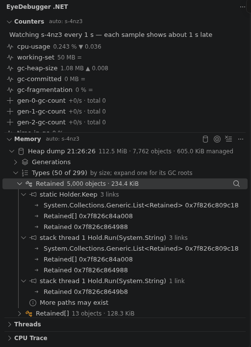

# EyeDebugger for VS Code

Debug alongside an AI agent. [eyedbg](https://github.com/EyeDebugger/eyedebugger) is a CLI-first
debugger that agents drive from the shell; this extension lets you join the agent's live debug
session in VS Code — see where it stopped, its breakpoints, what it does — and take or ask for
control. Or start a session yourself with F5 and let the agent join you.

## Install

Download `eyedebugger_X.Y.Z_vscode.vsix` from a [GitHub
release](https://github.com/EyeDebugger/eyedebugger/releases), then:

```sh
code --install-extension eyedebugger_X.Y.Z_vscode.vsix
```

Optionally check its provenance: `gh attestation verify eyedebugger_X.Y.Z_vscode.vsix -R
EyeDebugger/eyedebugger`.

## Requirements

- `eyedbg` with editor support (`eyedbg version --json` lists `dap.collab`), on your `PATH` or set
  in `eyedbg.path`.
- The debug adapter for your language, as eyedbg needs it (`eyedbg adapters ls`).
- For the .NET views: `eyedbg` with its .NET side helper (`eyedbg version --json` lists
  `dotnet.helper`, `dotnet.dump`, `dotnet.trace`) and the .NET runtime it runs on.

## Getting started

**Help → Get Started** has a walkthrough, "Get started with EyeDebugger": check `eyedbg`, install
the debug adapters, join a session, watch the agent and start your own session.

## When an agent starts debugging

While the window has focus and no eyedbg session is joined, the extension looks for sessions every
5 seconds (`eyedbg sessions`, which never starts the eyedbg daemon). When an agent is debugging a
program in this workspace, it asks: "agent is debugging app.py in this workspace (s-7f3k, python,
stopped)." **Join** joins the session; **Ignore** never asks about that session again. It asks once
per session, and never about a session you joined or started. Set `eyedbg.autoJoin` to `never` to
turn it off.


## Join a session

When an agent runs `eyedbg start …`, open **Run and Debug**: the list has a "Join s-7f3k — …"
entry per running session. Or press F5 with no launch configuration, or run **EyeDebugger: Join
Session…**; with several sessions you pick one. In `launch.json`:

```json
{ "type": "eyedbg", "request": "attach", "name": "Join eyedbg session" }
```

Add `"session": "s-7f3k"` to join a given one. Disconnecting leaves the session running.

## Start a session (F5)

```json
{
  "type": "eyedbg",
  "request": "launch",
  "name": "Debug app.py",
  "lang": "python",
  "program": "${workspaceFolder}/app.py",
  "args": ["loop"],
  "stopOnEntry": true
}
```

VS Code runs `eyedbg dap --launch` as its debug adapter and sends the configuration as a DAP
`launch`: the session starts as you (you hold control), a .NET build's output streams to the Debug
Console while it runs, and your breakpoints are in place before the program starts. The agent can
join it too (`eyedbg sessions`). Other properties: `project`, `cwd` (relative: to the workspace
folder), `env`, `opts` (language options), `noBuild`, `leasePolicy` (`free`, `handoff`,
`human-priority`), `exceptions` (`all`, `uncaught`, `none`) and, for dotnet, `adapter`
(`netcoredbg`, the default, or `sharpdbg` once `eyedbg adapters install sharpdbg` has fetched it;
SharpDbg can't pause). A property name in another case (`Program`) is dropped. Stop ends the
session and removes it from `eyedbg sessions`; Restart starts the program again, as a new session.
Launching needs an eyedbg that lists `dap.launch` in `eyedbg version --json`.

### launch.json snippets

In `launch.json`, **Add Configuration…** lists the EyeDebugger snippets: join a session, a Python
file, a Python module (`python -m`), a .NET project (built first) and a built .NET program.


## Control

Whoever holds a session's control lease drives it: continue, step, pause, set variables. The status
bar shows who holds it (you, the agent, nobody), the lease policy and pending requests; click it
for the actions the policy allows: take control, take it by force, request it, release it, give it
to someone, change the policy. When a step is refused because the agent has control, a notice
offers **Request Control** and **Take Over**. When the agent asks for control, you're asked
whether to give it. After you take control from an agent under the `free` policy (where the
agent's next run or step takes it back), the extension offers to switch the session to
`human-priority`, so the agent has to ask to get it back (`eyedbg.lease.afterTakeOver`).

## The agent's breakpoints

The agent's breakpoints show as red dots, with whose they are and what they do at the end of the
line (`⬥ agent · if total > 3`); hover the line for details. Removing such a red dot only hides it
from your editor. Right-click the line number for:

- **Copy as My Breakpoint** — a breakpoint of your own there, with the same condition.
- **Remove Breakpoint for Everyone…** — removes the agent's breakpoint from the session (after you
  confirm).

## See what the agent does

Run and Debug has two views. VS Code shows them collapsed the first time: expand them.

- **EyeDebugger Activity** — what other clients did since you joined, newest first: "agent stepped
  over → app.py:13", "agent continued → app.py:20 (breakpoint)", breakpoints added or removed,
  control changes. Click a step or a breakpoint to open its line. **Filter…** hides kinds of
  entries (`eyedbg.activity.hide`), **Clear** empties the view, and **EyeDebugger: Show Activity**
  has the full log, one line per event.
- **EyeDebugger Clients** — who is in each session you joined, who has control and when each was
  last seen. Right-click a client to request control from its holder, take it, release it, or give
  it to someone; **Refresh** re-reads the list.


## Follow the agent

When the agent's step or run stops, the editor shows the line, in the editor group already showing
that file, without taking your keyboard focus: you can keep typing in a terminal. VS Code doesn't
raise its window or focus the editor for these stops (eyedbg marks them as another client's). The
eye button in the Activity view's title, or `eyedbg.followAgent`, turns following off; the Call
Stack view still shows the stop. VS Code doesn't focus the frame of a stop it wasn't asked to
focus, and no extension can do it for it without taking your focus: after the agent's step it may
keep the frame it last focused — that line stays highlighted too, and the Variables view shows that
earlier stop — until you click the top frame in Call Stack.

## .NET diagnostics

In a workspace with a .NET project (`.csproj`, `.fsproj`, `.vbproj`, `.sln`, `.slnx`) the activity
bar has **EyeDebugger .NET**, with four views; elsewhere run **EyeDebugger: Show .NET Views**. They
run `eyedbg dotnet …` and show what it reports: names, sizes, counts and stacks, never the
program's values.

**Target.** All four views inspect one process, shown in their title bar: by default (`auto`) the
program of the active eyedbg debug session, else of the only one you joined. **Choose .NET
Target…** (the target button) lists the .NET processes of your user (`eyedbg dotnet ps`), joined
sessions first; pick one, or go back to auto. A session is targeted as such, so eyedbg checks it
still runs that program.

- **Counters** — live runtime counters (`eyedbg dotnet counters --watch`): CPU, working set, GC
  heap and collections, allocations, exceptions, thread pool, locks, JIT. A gauge shows its value
  and change (`12.3 % ▲ 11.8`), a sum its growth per second and total since you started
  (`+2,048 B/s · total 6,144 B`). Each sample shows about a second late. **Pause** ends the watch
  (nothing stays attached to the program); **Start** starts a new one. A program stopped at a
  breakpoint sends no samples, and a stopped one can't start a watch: when it's a session you
  joined, the watch starts by itself when the program runs again.
- **Memory** — **Take Heap Dump** writes a heap dump (the program is suspended while it's written)
  and lists the types that take the most memory, with their object counts. Expand a type to see
  why its objects are alive: up to three paths from a GC root (`static Holder.Keep`, a thread's
  stack, a handle) to one of them, found once per dump and type. Right-click a dump for **Show
  Threads of This Dump** and **Copy Dump Path**. **Open Dump File…** reads any `.dmp`. The last
  three dumps stay listed.
- **Threads** — **Capture Threads** takes a heap dump and lists every managed thread's stack,
  grouped when identical, lock owners and waiters first, with the locks held and waited for.
  Click a frame with a source line to open it.
- **CPU Trace** — **Start Trace** records the program for 1 s to 5 min (it runs slower
  meanwhile): **CPU** lists its hottest methods, exclusive and inclusive, and where it waited;
  **GC** its collections, pauses and allocations. **Open Trace File…** reads a `.nettrace`.



Every operation shows its progress and can be cancelled. Dumps and traces stay in eyedbg's private
directory (`~/.eyedbg/dumps` and `~/.eyedbg/traces`, removed after 7 days, at most 10 of each
kept); the views show and copy their paths, and never read, copy, move or delete them.

## Settings

| Setting | Default | |
|---|---|---|
| `eyedbg.path` | `""` | Absolute path of `eyedbg` (`~/` allowed). Empty: `eyedbg` on `PATH`. User settings only. |
| `eyedbg.clientName` | `""` | You join as `human:NAME`. Empty: your OS user name. User settings only. |
| `eyedbg.lease.afterTakeOver` | `ask` | After taking control from an agent under `free`: `ask`, `humanPriority` or `keep`. |
| `eyedbg.autoJoin` | `ask` | Offer to join an agent's session of a program in this workspace: `ask` or `never`. |
| `eyedbg.followAgent` | `true` | Show the agent's stops in an editor, without taking focus. |
| `eyedbg.activity.hide` | `[]` | Kinds the Activity view hides: `exec`, `breakpoint`, `lease`, `client`, `exceptions`. |

## Security

- `eyedbg.path` and `eyedbg.clientName` can only be set in user settings, never by a workspace; the
  PATH search skips relative entries and the current directory. The extension runs `eyedbg`
  directly, never through a shell.
- The extension doesn't run in Restricted Mode: starting a session builds and runs the workspace's
  code.
- In a trusted workspace it starts with the window, to check for agent sessions every 5 seconds
  while the window has focus and no session is joined (`eyedbg sessions`, which never starts the
  daemon); `eyedbg.autoJoin: never` stops it. It never joins without your click.
- Text from a session (the agent's conditions, messages, names) is shown as plain text: nothing in
  it becomes a link or markup. So are the names a .NET program or its dumps report (types,
  methods, modules, files, processes).
- A heap dump holds the program's memory, secrets included. The .NET views keep dumps and traces
  in eyedbg's private directory and never read them; `eyedbg dotnet …` only inspects processes of
  your own user.
- A frame's source file is the path the program's PDB recorded when it was built. The Threads view
  opens it only if it is a local absolute path of a regular file — never a network (UNC) or device
  path, which it doesn't even look up.

## Known limitations

- The exception filters (All / Uncaught) are offered for every launch, also for a language whose
  debug adapter can't serve one: choosing it then says so in the Debug Console.
- When a step is refused, VS Code shows its own error beside the extension's notice.
- After the agent's stop, VS Code may keep the frame it last focused (its line stays highlighted
  and the Variables view shows that earlier stop) until you click the top frame in Call Stack.
- In the window where you first trust the folder, the walkthrough's "Install eyedbg" step doesn't
  check itself off after **Check eyedbg**; it does in the next window.
- The join prompt names the session's state when it last looked, e.g. `starting` while the agent's
  program is still starting.
- The Activity view starts when you join: what the agent did before isn't listed (`eyedbg events`
  has it).
- A client's "last seen" moves with its activity; a client that only reads (`eyedbg status`,
  `eyedbg vars`) shows its new time after **Refresh**.
- The .NET views appear in workspaces with a .NET project; elsewhere, run **EyeDebugger: Show .NET
  Views**.
- Counters need a running program: a program stopped at a breakpoint sends no samples, and each
  sample shows about a second late.
- A heap dump suspends the program while it's written (a second or more for a small program).
- On Windows a heap dump has no source lines, so the Threads view can't open a frame's file there.
- Cancelling a dump or a trace on Windows ends `eyedbg` at once (Windows has no Ctrl-C for it), so
  its partial file stays in eyedbg's private directory until it's pruned (7 days, at most 10 kept).
  Elsewhere eyedbg removes it.
